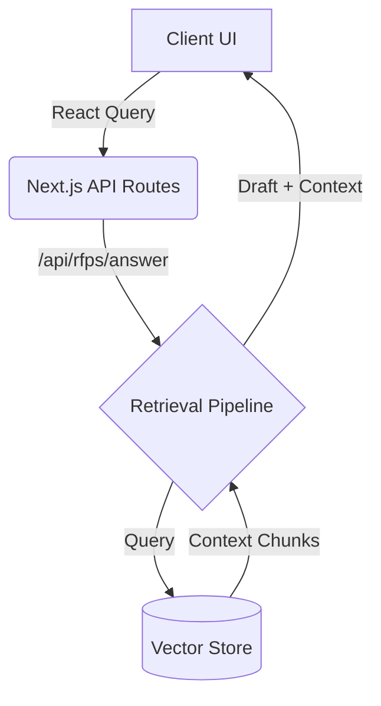

<div align="center">
  <h1>✨ Lumina Proposals</h1>
  <p><strong>Enterprise-Grade AI Automation for Requests for Proposals (RFPs) and Security Questionnaires</strong></p>

  [](https://nextjs.org/)
  [](https://react.dev/)
  [](https://www.typescriptlang.org/)
  [](https://tailwindcss.com/)
  [](LICENSE)
</div>

<br />

## 📖 Overview

Lumina Proposals is a modern, full-stack enterprise SaaS application designed to drastically reduce the time engineering and sales teams spend answering 100+ page corporate RFPs. 

By leveraging **Retrieval-Augmented Generation (RAG)**, Lumina ingests internal company knowledge bases (SOC2 reports, whitepapers, past proposals) and automatically drafts highly accurate, context-aware answers to incoming questionnaires.

> **Note:** The current `main` branch contains the complete Frontend UI, Routing, and Architectural Blueprint. The Database and AI Generation endpoints are currently mocked to allow for rapid UI/UX iteration and testing.

---

## 🚀 Key Features

* **The "Triage Queue" Paradigm:** A Superhuman-inspired immersive interface for reviewing AI-generated answers. Reviewers are presented with one question at a time, side-by-side with the exact source documents the AI used. Answers can be edited, regenerated, or instantly approved with smooth `framer-motion` transitions.
* **Knowledge Base Ingestion:** Dedicated workspaces to upload and index technical documents, policies, and case studies into the vector store.
* **Luxury Design System:** Built with `shadcn/ui`, Tailwind CSS, and custom glassmorphic aesthetics to provide a premium enterprise feel.
* **Real-time Analytics:** A comprehensive dashboard featuring dynamic charts (via `recharts`) tracking RFP progress, AI confidence distribution, and team activity.

---

## 🧠 System Architecture

The application is built as a monolithic Next.js app, tightly coupling the React frontend with Node.js backend API routes for rapid AI prototyping.



---

## 🛠️ Tech Stack

* **Framework:** Next.js 15 (App Router)
* **Language:** TypeScript (Strict Mode)
* **Styling:** Tailwind CSS + `shadcn/ui`
* **Animations:** Framer Motion
* **State & Data Fetching:** React Query (`@tanstack/react-query`) + Zustand
* **Icons:** Lucide React
* **Charts:** Recharts

---

## 💻 Local Development

To run Lumina Proposals locally and test the Triage Queue UI:

1. **Clone the repository:**
   ```bash
   git clone https://github.com/NallaSumang/Lumina-Proposals.git
   cd Lumina-Proposals
   ```

2. **Install dependencies:**
   *(Note: use `--legacy-peer-deps` due to React 19 RC dependencies)*
   ```bash
   npm install --legacy-peer-deps
   ```

3. **Start the development server:**
   ```bash
   npm run dev
   ```

4. **Experience the app:**
   Open [http://localhost:3000](http://localhost:3000) in your browser. Click into any Active RFP on the dashboard to experience the immersive Triage Queue workflow.

---

## 🤝 Handoff & Next Steps

This repository is perfectly structured and waiting for final backend integration. The following steps are required for production readiness:

1. **Authentication:** Implement a provider (e.g., NextAuth, Clerk, Supabase Auth) to secure the `/(app)` routes.
2. **Database:** Replace the mock arrays in `lib/mock.ts` with a real database ORM (e.g., Prisma + PostgreSQL).
3. **AI & Vector DB:** In `ai-rag/services/`, swap the in-memory `VectorStore` with Pinecone/ChromaDB, and replace the `mockGenerate` function with actual API calls to OpenAI or Anthropic.

---

<div align="center">
  <i>Engineered with precision for modern sales teams.</i>
</div>
